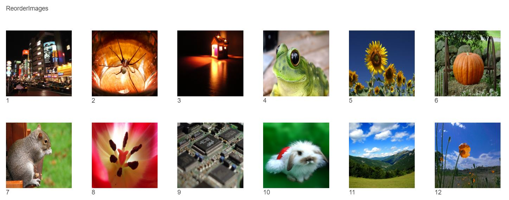

# react-reorder-images

React component to reorder images styled in bootstrap

## Example



```html
<!-- Put bootstrap cdn link (like below) in index.html of your React App -->
<!-- Latest compiled and minified CSS -->
<link
  rel="stylesheet"
  href="https://stackpath.bootstrapcdn.com/bootstrap/3.4.1/css/bootstrap.min.css"
  integrity="sha384-HSMxcRTRxnN+Bdg0JdbxYKrThecOKuH5zCYotlSAcp1+c8xmyTe9GYg1l9a69psu"
  crossorigin="anonymous"
/>
```

```jsx
import React, { Component } from 'react';
import ReorderImages from 'react-reorder-images';

const images = [
  {
    url:
      'https://images.freeimages.com/images/large-previews/e51/tokyo05-2-1447803.jpg',
    caption: '1'
  },
  {
    url:
      'https://images.freeimages.com/images/large-previews/aae/lomo-spider-1386711.jpg',
    caption: '2'
  },
  {
    url:
      'https://images.freeimages.com/images/large-previews/383/the-home-of-the-candle-1-1425911.jpg',
    caption: '3'
  },
  {
    url:
      'https://images.freeimages.com/images/large-previews/e71/frog-1371919.jpg',
    caption: '4'
  },
  {
    url:
      'https://images.freeimages.com/images/large-previews/199/sunflowers-6-1392951.jpg',
    caption: '5'
  },
  {
    url:
      'https://images.freeimages.com/images/large-previews/9a4/large-pumpkin-1387927.jpg',
    caption: '6'
  },
  {
    url:
      'https://images.freeimages.com/images/large-previews/1cb/close-squirrel-1381764.jpg',
    caption: '7'
  },
  {
    url:
      'https://images.freeimages.com/images/large-previews/754/details-of-a-tulip-2-1375972.jpg',
    caption: '8'
  },
  {
    url:
      'https://images.freeimages.com/images/large-previews/ca1/scsi-hd-1626366.jpg',
    caption: '9'
  },
  {
    url:
      'https://images.freeimages.com/images/large-previews/815/xmas-bunny-1313404.jpg',
    caption: '10'
  },
  {
    url:
      'https://images.freeimages.com/images/large-previews/53b/montenegro-sky-1370598.jpg',
    caption: '11'
  },
  {
    url:
      'https://images.freeimages.com/images/large-previews/b74/wild-poppies-1384853.jpg',
    caption: '12'
  }
];

class App extends Component {
  updateImages = images => console.log('updated- images', images); // Write your own logic

  render() {
    return (
      <div>
        <br />
        <div className='container'>
          <div className='row' style={{ padding: '20px' }}>
            ReorderImages
          </div>
          <div className='row'>
            <ReorderImages images={images} callback={this.updateImages} />
          </div>
        </div>
      </div>
    );
  }
}

export default App;
```

## Install

```cli
npm install react-reorder-images
```

## Props

##### `images`

An array of object with properties like 'url' and 'caption'.

```js
const images = [
  {
    url:
      'https://images.freeimages.com/images/large-previews/b74/wild-poppies-1384853.jpg',
    caption: '12'
  }
];
```

---

##### `callback`

A callback function to get updated array of object of images.

## License

MIT
